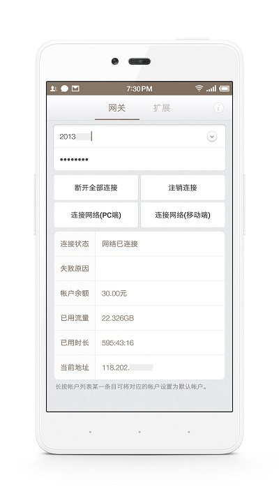
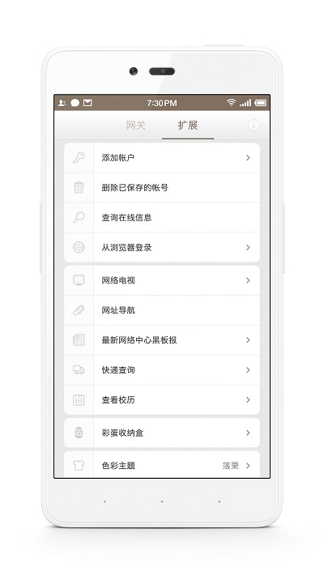

# 东大IPGW

[](https://github.com/liying2008/neu-ipgw/releases)
[](https://codeload.github.com/liying2008/neu-ipgw/zip/master)
[](https://github.com/liying2008/neu-ipgw/blob/master/LICENSE)
[](http://weibo.com/neuliying)
---
 **此项目已于2017年6月24日停止维护。**

[Download APK](https://github.com/liying2008/neu-ipgw/releases/download/v4.3.5/ipgw_4.3.5_fir.apk)

编译环境
----
- Android Studio 2.3.2
- Gradle 3.3

### 说明
1. 编译此项目需要Android SDK（版本>=25）和NDK（版本>=android-ndk-r11c）。
1. 快递查询使用的是快递鸟（[http://www.kdniao.com/](http://www.kdniao.com/)）提供的接口，但此开源项目里不提供调用其接口所需要的<code>APP_KEY</code>，如果需要快递查询功能，请自行去快递鸟官网注册申请。之后将申请到的<code>APP_KEY</code>填入<code>app/src/main/cpp/native-lib.cpp</code>文件中,赋值给<code>appKey</code>变量。再将<code>EBusinessID</code>填入<code>app/src/main/java/com/liying/ipgw/utils/KdApiUtils.java</code>文件中，赋值给<code>EBusinessID</code>常量。  

主要功能
----
该应用用于快速登录东北大学校园网网关，避免了通过浏览器登录的繁琐操作。

使用说明
----
用户点击[连接网络(移动端)]按钮即可连接到外网，点击[连接网络(PC端)]按钮可模拟PC端连网，点击[注销连接]按钮即可断开本设备与外网的连接，点击[断开全部连接]按钮可断开所有设备与外网的连接。  

**设置默认帐户的两种方式：**  

 - 在“网关”页面长按用户名输入框可将当前帐户设置为默认帐户。  
 - 在帐户列表选择框中长按某一条目可将对应的帐户设置为默认帐户。  

其他说明
----
1. 在“网关”页面填入的用户名和密码仅当次生效，在未设置为默认帐户的情况下不会被保存。   
1. 项目开源地址：[https://github.com/liying2008/neu-ipgw](https://github.com/liying2008/neu-ipgw)。  
 
屏幕截图
----




更新日期
----
2017-5-14

当前版本
----
v4.3.5

下载地址
----
应用“东大IPGW”已上线**360手机助手、小米应用商店、百度手机助手、应用宝、91助手、安卓市场、锤子应用商店**。你可以在以上平台的官网或客户端搜索“东大IPGW”进行下载。

联系作者
----
新浪微博：[@独毒火](http://weibo.com/neuliying)   
邮箱：[liruoer2008@yeah.net](mailto:liruoer2008@yeah.net)   

Thanks
----
- [ViewPagerIndicator](https://github.com/LuckyJayce/ViewPagerIndicator)
- [glide](https://github.com/bumptech/glide)
- [PhotoView](https://github.com/chrisbanes/PhotoView)
- [nohttp](https://github.com/yanzhenjie/NoHttp)
- [html-textview](https://github.com/SufficientlySecure/html-textview)
- [pinyin4j](http://pinyin4j.sourceforge.net/)
- [东北大学IP控制网关](https://ipgw.neu.edu.cn)
- [东北大学IPv6视频直播测试站](http://hdtv.neu6.edu.cn/)
- [友盟统计](http://www.umeng.com/)
- [iconfont](http://iconfont.cn/)

License
----

```
Copyright 2015-2017 LiYing

Licensed under the Apache License, Version 2.0 (the "License");
you may not use this file except in compliance with the License.
You may obtain a copy of the License at

   http://www.apache.org/licenses/LICENSE-2.0

Unless required by applicable law or agreed to in writing, software
distributed under the License is distributed on an "AS IS" BASIS,
WITHOUT WARRANTIES OR CONDITIONS OF ANY KIND, either express or implied.
See the License for the specific language governing permissions and
limitations under the License.
```
